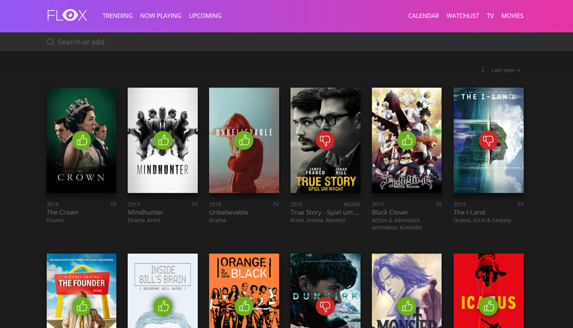

# Flox-Docker

## This is a docker-container for the flox watchlist. Be sure to check out the original project: https://github.com/devfake/flox

Flox is a self hosted Movie, Series and Animes watch list. It's build on top of Laravel and Vue.js and uses [The Movie Database](https://www.themoviedb.org/) API.
The rating based on an 3-Point system for `good`, `medium` and `bad`.

### [Try live demo](https://flox-demo.pyxl.dev) and [login](https://flox-demo.pyxl.dev/login) with `demo / demo` to add new stuff or change ratings.

### Running in Docker

This project can be run in a Docker container, it exposes only port 80. It is advised 
to run this configuration through a reverse proxy providing SSL if the service will be exposed over the internet. Data 
is saved in the container at /var/www/flox/.

At least it is needed that you set `TMDB_API_KEY` with your own TMDP API key. It is also recommended that you set `FLOX_ADMIN_PASS`.

An minimal example run would be

    # with docker run
    cd <PROJECT_ROOT>
    docker build . -t flox:latest
    docker run -p '8080:80' --volume '/<PROJECT_ROOT>/target/:/var/www/flox' -e TMDB_API_KEY=<KEY> -e FLOX_DB_INIT=true -name flox flox:latest
    
    # with docker-compose (be sure to check all environment variables and change when neccesary)
    cd <PROJECT_ROOT>
    docker-compose up -d
    
You can then connect to localhost:8080 to access the application and any changes you make will be saved in /<PROJECT_ROOT>/target/.

In order to create an admin user you will need to run an initial migration. This can be done by running the container 
once with the environment variable FLOX_DB_INIT=true, or exec'ing into the container and manually running 
php artisan flox:db

Supportet Environment variables
-----
| Name | Description |
|--|--|
|  |  |
| **Flox Application** |  |
| FLOX_APP_URL | The URL you will be hosting the app on *(default: http://localhost)* | 
| FLOX_APP_ENV | The laravel app env *(default: local)* |
| FLOX_APP_DEBUG | Run in debug mode *(default: false)* |
| FLOX_CLIENT_URI | The relative path you are hosting on *(default: /)* |
| FLOX_TIMEZONE | The timezone Flox is running in *(default: UTC)* |
| FLOX_DAILY_REMINDER_TIME | The daily reminder time *(default: 10:00)* |
| FLOX_WEEKLY_REMINDER_TIME | The weekly reminder time *(default: 20:00)* |
|  |  |
| UID | Unix user ID to run the container as |
| GID | Unix group ID to run the container as |
| TMDB_API_KEY | **(required)** The TMDB API key to use - required for startup *(https://developers.themoviedb.org/3/getting-started/introduction)* |
| FLOX_DB_INIT | **(required)** Run db init at container startup *(default: false)* |
|  |  |
| FLOX_ADMIN_USER | **(required)** The admin username for FLOX_DB_INIT *(default: admin)* |
| FLOX_ADMIN_PASS | **(required)** The admin password for FLOX_DB_INIT *(default: admin)* |
|  |  |
| | *Set each to blank to disable mail* |
| FLOX_MAIL_DRIVER | Mail Driver |
| FLOX_MAIL_HOST | Hostname of the mail server |
| FLOX_MAIL_PORT | Port of the mail server (SMTP Port) |
| FLOX_MAIL_USERNAME | User name on the mail server |
| FLOX_MAIL_PASSWORD | User password |
| FLOX_MAIL_ENCRYPTION | Encryption Type (tls,ssl,none) |
|  |  |
| **Database** |  |
| FLOX_DB_CONNECTION | **(required)** The database connection to use *(default: sqlite)* |
| FLOX_DB_NAME | **(required)** The DB Name (or path if sqlite) *(default: /var/www/flox/backend/database/database.sqlite)* |
| FLOX_DB_HOST | The database host |
| FLOX_DB_PORT | The database port |
| FLOX_DB_USER | The database user | 
| FLOX_DB_PASS | The database password |

### Contribution

Like this project? Want to contribute? Awesome! Feel free to open some pull requests or just open an issue.

### Changelog

Detailed changes for each release are documented in the [release notes](https://github.com/devfake/flox/releases).

### License

Flox is published under the MIT license. See LICENSE for more information.
